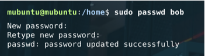
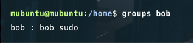
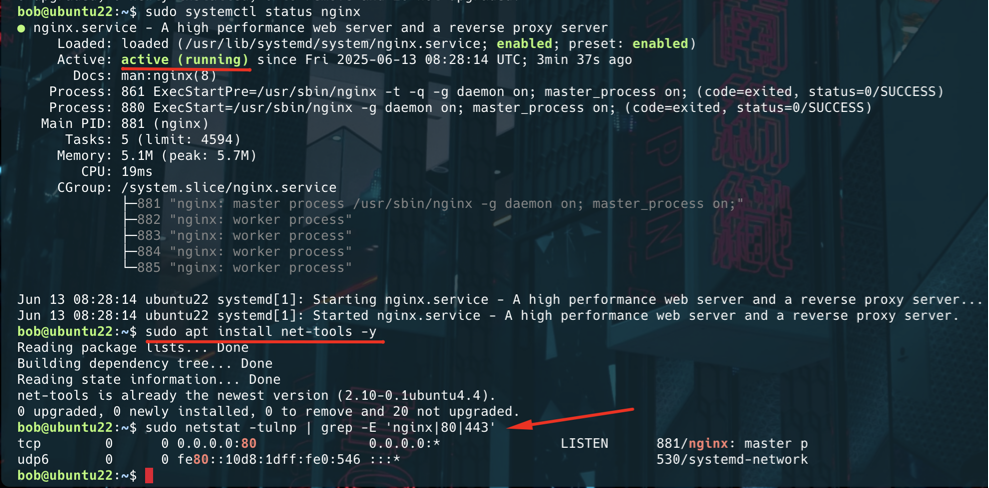

## Детальний опис кроків та скріншоти

Кожен крок виконання задокументований відповідним скріншотом, що ілюструє процес.

### 1. Створення користувача "bob"

Процес почався зі створення нового системного користувача з іменем "bob". Для цього була використана команда `sudo useradd -m -s /bin/bash bob`, яка створила користувача, його домашній каталог (`/home/bob/`) та призначила йому оболонку Bash.

### 2. Встановлення пароля для користувача "bob"

Після створення користувача, для нього було встановлено пароль за допомогою команди `sudo passwd bob`. Це є обов'язковим кроком для подальшого входу в систему під цим користувачем та використання `sudo`.

### 3. Додавання користувача "bob" до групи `sudo`

Користувача "bob" було додано до групи `sudo` за допомогою команди `sudo usermod -aG sudo bob`. Ця дія надає користувачеві "bob" необхідні адміністративні привілеї для виконання команд з `sudo`.

### 4. Перевірка членства користувача "bob" у групі `sudo`

Щоб підтвердити успішне додавання "bob" до групи `sudo`, була використана команда `groups bob`. Вивід цієї команди clearly показав наявність "sudo" у списку груп користувача.

### 5. Створення файлу сценарію зміни імені хоста

В домашньому каталозі користувача "bob" (`/home/bob/`) було створено файл `hostname_changer.sh`. Цей файл містить Bash-сценарій, відповідальний за зміну імені хоста системи.

### 6. Написання Bash-сценарію для зміни імені хоста

Вміст сценарію `hostname_changer.sh` був визначений наступним чином. Він використовує `hostnamectl` для встановлення нового імені хоста та `sed` для оновлення відповідних записів у `/etc/hosts`, забезпечуючи повну консистентність змін.

### 7. Запуск скрипта та ребут системи

Сценарій hostname_changer.sh був запущений з домашнього каталогу користувача "bob" (./hostname_changer.sh). Після його успішного виконання, система була перезавантажена за допомогою sudo reboot для застосування всіх змін імені хоста.

### 9. Перевірка імені хоста після перезавантаження
Після перезавантаження, був виконаний вхід як користувач "bob". Для перевірки, чи змінилося ім'я хоста на "ubuntu22", була використана команда hostname. Вивід підтвердив успішність операції.

### 10. Встановлення Nginx
Веб-сервер Nginx був встановлений за допомогою менеджера пакетів apt командою sudo apt install nginx -y.

### 11. Перевірка статусу Nginx та відкритих портів

На завершальному етапі були виконані дві перевірки:

sudo systemctl status nginx для підтвердження, що веб-сервер Nginx успішно запущений і працює.
sudo netstat -tulnp | grep -E 'nginx|80|443' для перегляду відкритих мережевих портів, демонструючи, що Nginx прослуховує вхідні з'єднання (зазвичай на порту 80 для HTTP).

