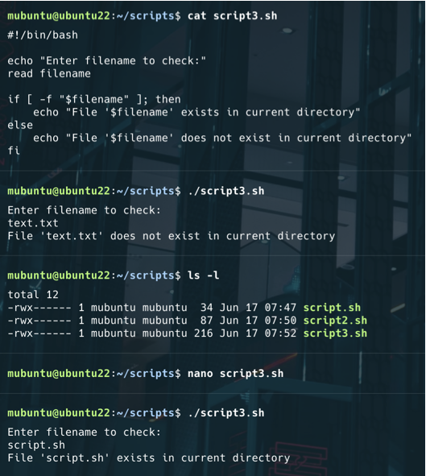

### **Вправа 1: Hello World**

**Завдання:** Напишіть Bash-сценарій, який просто виводить "Hello, World!" при виконанні.

---

### **Вправа 2: Введення даних користувачем**

**Завдання:** Створіть сценарій, який запитує ім'я користувача, а потім вітає його, використовуючи це ім'я.

---

### **Вправа 3: Умовні оператори**

**Завдання:** Напишіть сценарій, який перевіряє, чи існує файл у поточному каталозі. Якщо він існує, виведіть повідомлення про його існування; інакше, виведіть повідомлення, що його не існує.

---

### **Вправа 4: Цикли**

**Завдання:** Створіть сценарій, який використовує цикл для виведення чисел від 1 до 10.

---

### **Вправа 5: Операції з файлами**

**Завдання:** Напишіть сценарій, який копіює файл з одного розташування в інше. Обидва розташування повинні передаватися як аргументи командного рядка.

---

### **Вправа 6: Маніпуляції з рядками**

**Завдання:** Створіть сценарій, який приймає введений користувачем рядок (речення) і потім реверсує його слово за словом (наприклад, "Hello World" стає "World Hello").

---

### **Вправа 7: Аргументи командного рядка**

**Завдання:** Розробіть сценарій, який приймає ім'я файлу як аргумент командного рядка і виводить кількість рядків у цьому файлі.

---

### **Вправа 8: Масиви**

**Завдання:** Напишіть сценарій, який використовує масив для зберігання списку фруктів. Пройдіть по масиву та виведіть кожен фрукт на окремому рядку.

---

### **Вправа 9: Обробка помилок**

**Завдання:** Розробіть сценарій, який намагається прочитати файл і витончено обробляє помилки. Якщо файл існує, він повинен вивести його вміст; якщо ні, він повинен відобразити повідомлення про помилку.

---

## Частина 2: Служба Systemd

Ця секція містить завдання на створення служби Systemd, яка моніторить каталог на наявність нових файлів, обробляє їх та перейменовує.

### **Завдання:**

Напишіть сценарій, який моніторить каталог `~/watch`. Якщо з'являється новий файл, він виводить вміст файлу та перейменовує його на `*.back`.

Напишіть службу Systemd для цього сценарію та запустіть її.

### **Рішення:**

Рішення складається з трьох основних компонентів:

1.  **Сценарій моніторингу (`watcher.sh`):**
    Цей Bash-сценарій використовує цикл для постійного моніторингу каталогу `~/watch`. Коли виявляється новий файл, він читає його вміст, виводить його, а потім перейменовує файл, додаючи розширення `.back`.

    

2.  **Файл одиниці служби Systemd (`watchdog.service`):**
    Цей файл описує службу Systemd, яка запускає сценарій `watcher.sh`. Він налаштований для автоматичного запуску при старті системи та перезапуску в разі збою.

    

3.  **Тестування служби:**
    Після створення та активації служби Systemd, її робота була перевірена шляхом створення нового файлу в каталозі `~/watch`. Було підтверджено, що служба коректно реагує на новий файл: виводить його вміст і перейменовує його.

    

---
