# DevOps 6 — Налаштування SSH, користувачів та Bash-гра

---

## Bash-гра: «Вгадай число»

Сценарій генерує випадкове число від 1 до 100 і зберігає його у змінній. Користувач має вгадати число:

📄 **Файл сценарію:** `gues_number.sh`

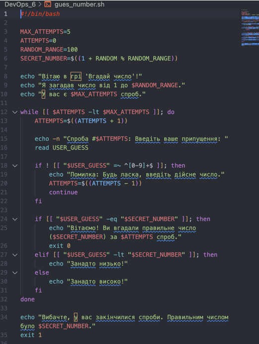

---

## 👤 Створення користувача `john`

Користувач `john` створюється зі стандартною домашньою директорією.

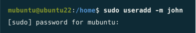

---

## ⚙️ Налаштування SSH-сервера (порт 2222)

Налаштовується основний SSH-сервер з такими параметрами:

- **порт:** 2222
- **доступ root:** ❌ (заборонено)
- **авторизація паролем:** ❌ (заборонено)
- **тільки john по ssh-ключу:** ✅ (дозволено)

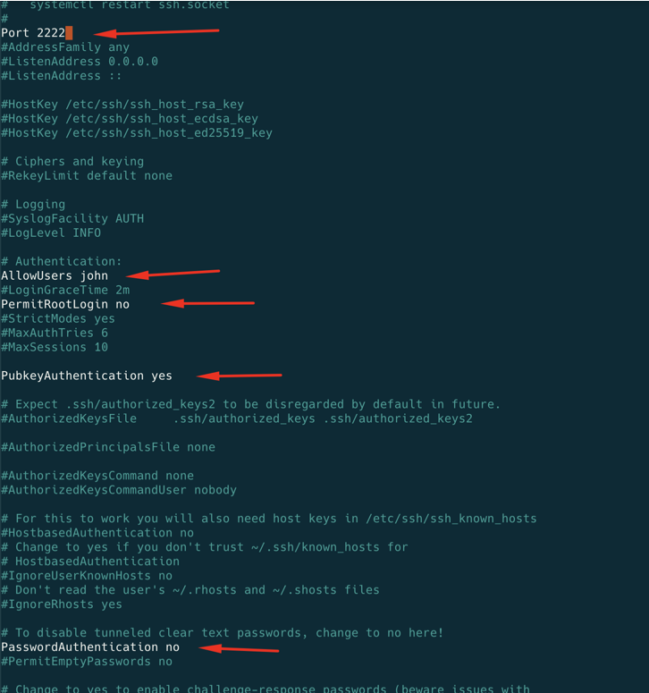

### Перевірка прослуховування порту 2222

Після налаштування конфігурації та перезапуску сервісу SSH, було перевірено, що сервер коректно прослуховує порт 2222 .

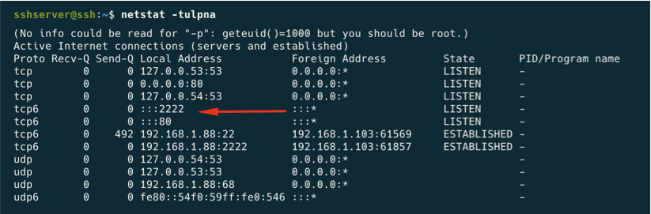

---

## 🔑 Генерація та копіювання SSH-ключа для `john`

Я створюю пару ключів на моєму mac. Публічний ключ потім копіюється в `~/.ssh/authorized_keys` який я створю для користувача `john` на сервері.

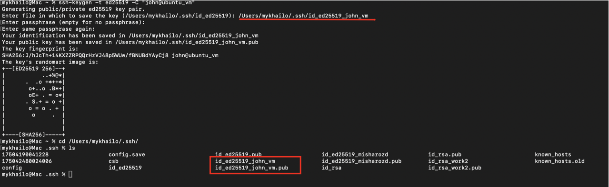

Заходимо як john та сворюєму для нього authorized_keys та налаштовуємо пермішени

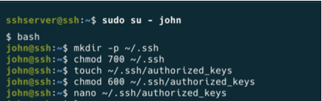

Перевіряємо

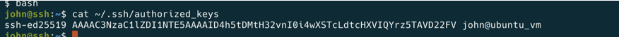

---

## 🧪 Успішне підключення до основного SSH-сервера (порт 2222)

Після всіх налаштувань та виправлень дозволів, було здійснено успішне підключення до основного SSH-сервера (порт 2222) за допомогою SSH-ключа користувача `john`.

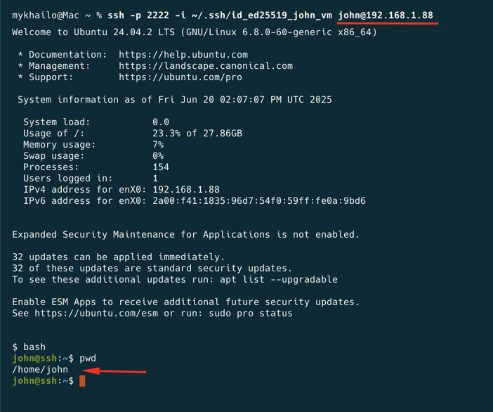

*Підтвердження активних сесій на сервері, включаючи сесію `john`:*

---
## 🔐 Заборонений вхід `root` та обмеження для інших користувачів

Налаштування SSH-сервера (порт 2222) забороняють вхід користувачу `root` та обмежують доступ лише для `john` (через `AllowUsers john`).

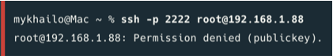

---

## Паралельний запуск SSH у debug-режимі на порту 3333

Для налагодження було запущено другий екземпляр SSH-сервера на порту 3333. Цей сервер має інші налаштування:

Спочатку скопіюємо існуючий конфіг щоб не модифікувати актуальний

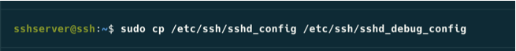

- дозволені всі користувачі (крім root)
- дозволена авторизація як по паролю, так і по ключу

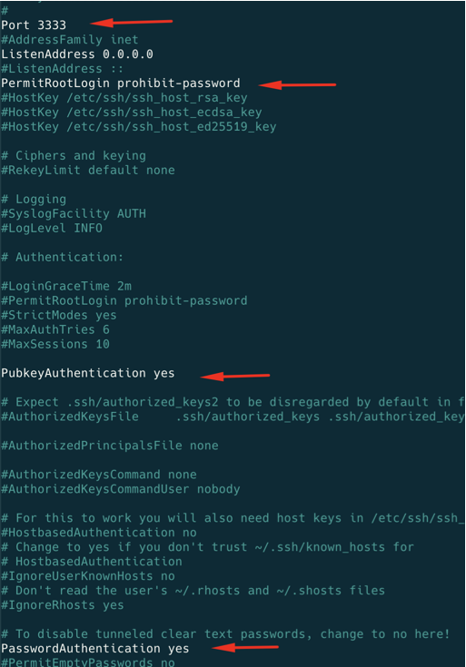

- запущено в debug-режимі для детального логування

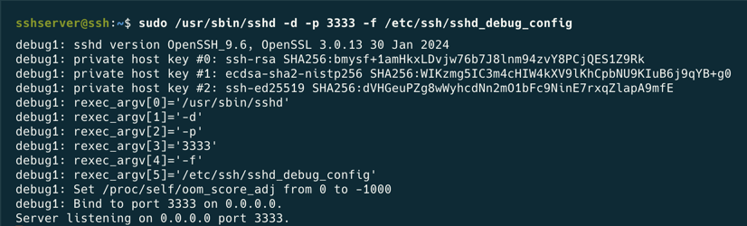

---

## Перевірка обох SSH-серверів

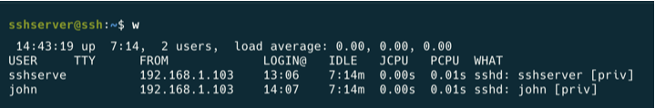

---

