# 🛠️ DevOps Task 7

---

## ✅ Task 1: User and Group Management

### 🔹 Управление пользователями и группами

**1. Создание пользователей разработчиков:**
-  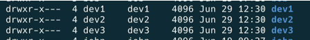

**2. Создание групп:**
-  

**3. Добавление пользователей в группы:**
-  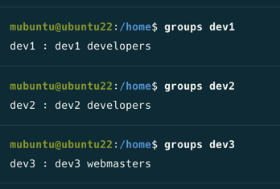

**4. Настройка группы по умолчанию:**
-  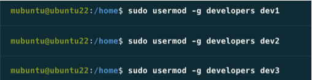

**5. Копирование пользователя:**

-  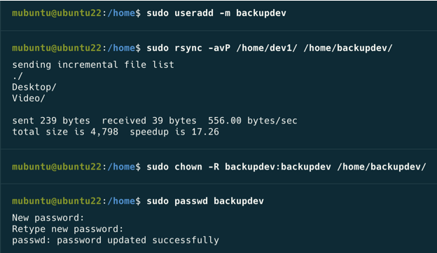

**6. Настройка прав доступа к общему проекту:**
-  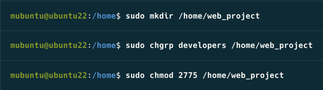

**7. Работа с расширенными атрибутами файлов:**
-  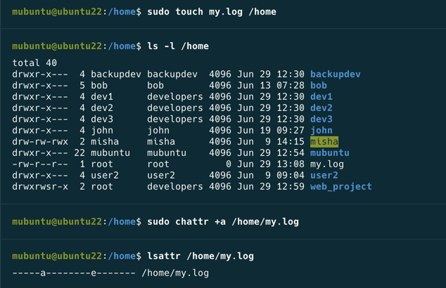

---

## ✅ Task 2: Disk Utilization Monitoring

### 📜 Скрипт мониторинга диска

**Настройка crontab:**
- 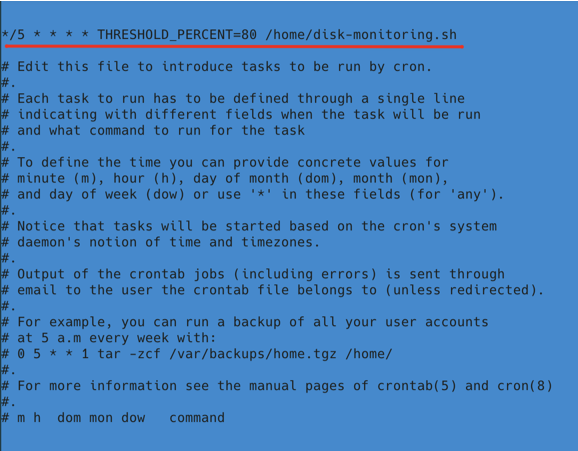

**Демонстрация работы:**
-  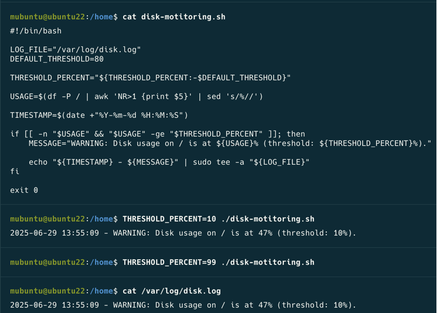

---

## ✅ Task 3: Monit Configuration for Nginx

### 🔧 Настройка Monit для мониторинга Nginx

**1. Установка и настройка Monit:**
-  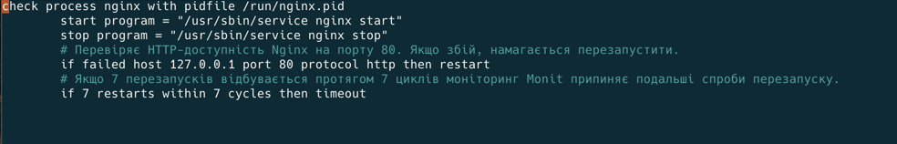

**2. Конфигурация для Nginx:**
-  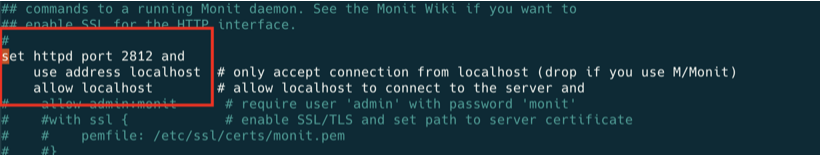

**3. Тестирование Monit с Nginx:**
-  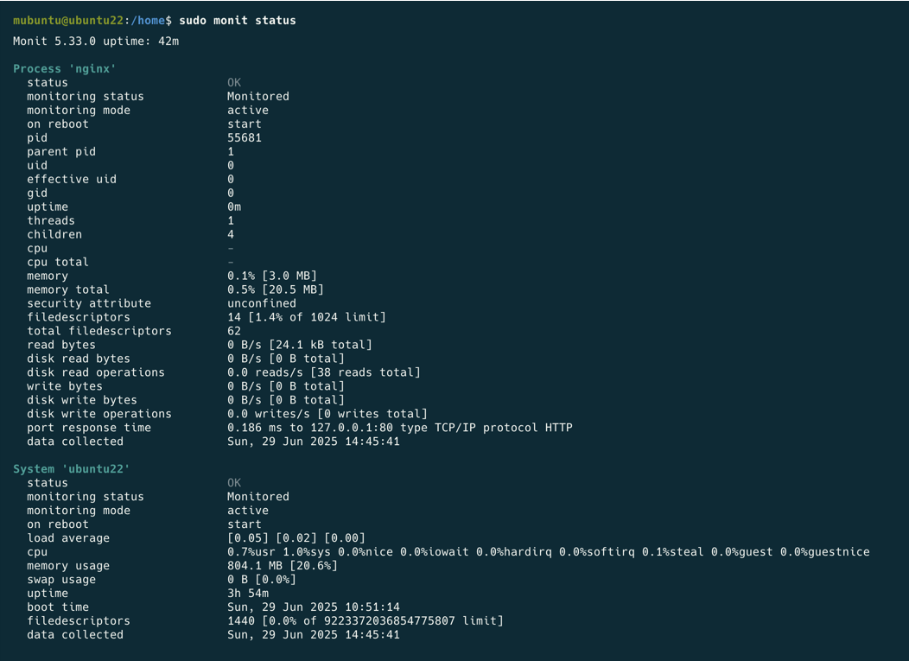
