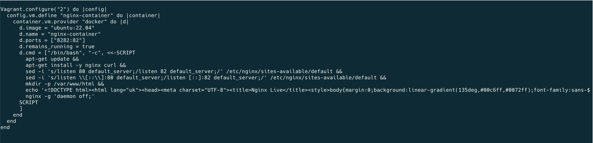
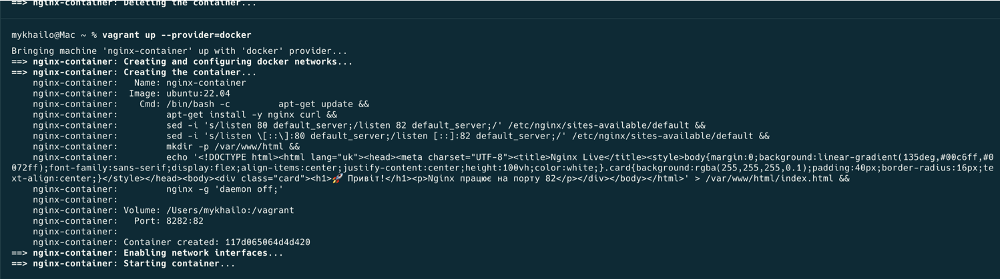

### ✅ 1. Vagrantfile (налаштування)


---

### ✅ 2. Успішний запуск nginx-контейнера


---

### ✅ 3. Результат у браузері (зробив кастомну сторінку html/css)


---

## 🧠 Коментар

Використано `Vagrant` з `Docker` як provider через те, що VirtualBox не підтримується на Mac із Apple Silicon (M3). Контейнер було налаштовано з `nginx`, який слухає на порту 82, а також було створено стилізовану сторінку.

---

## 🚀 Запуск

```bash
vagrant up --provider=docker
