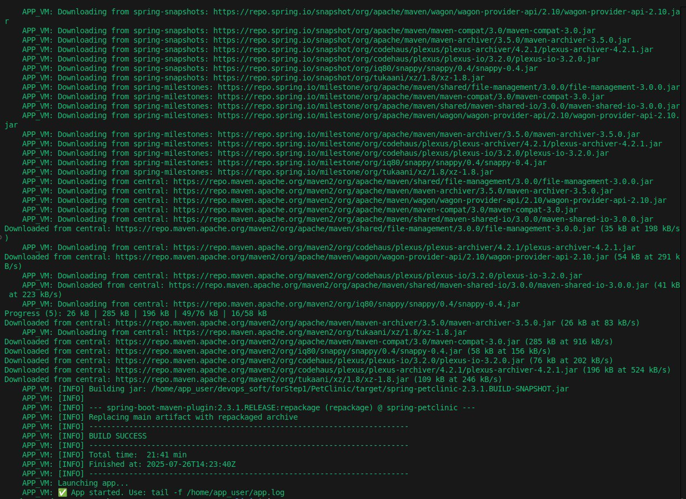
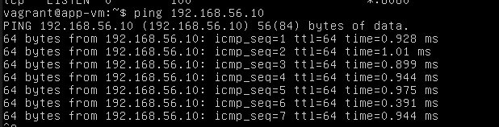
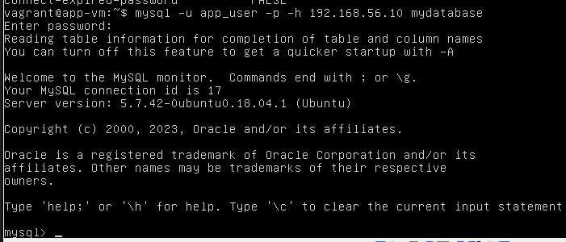
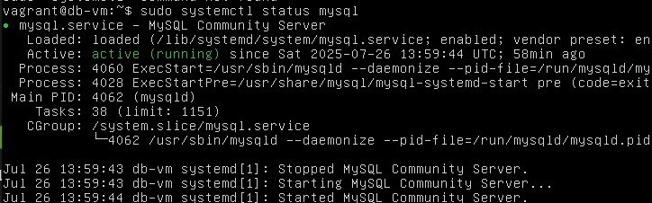
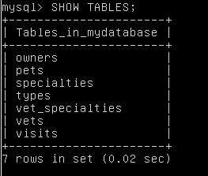
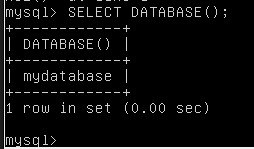
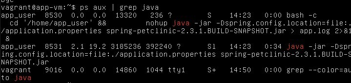
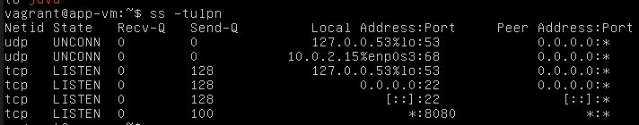
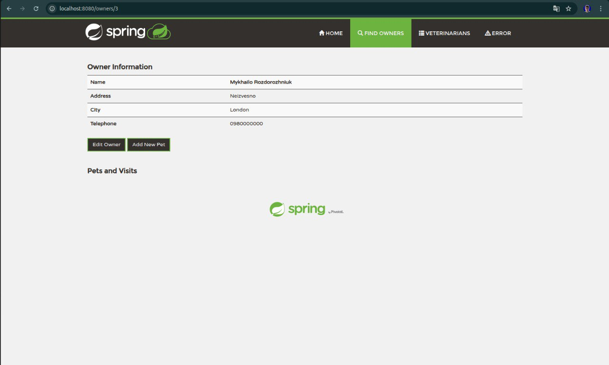

# PetClinic DevOps Project

## Опис проекту

Цей проект демонструє розгортання Spring Boot додатку PetClinic з використанням Vagrant, що включає:
- Дві віртуальні машини: APP_VM (додаток) та DB_VM (база даних)
- Автоматичне налаштування MySQL бази даних
- Розгортання Spring Boot додатку з підключенням до віддаленої бази даних
- Мережеве з'єднання між віртуальними машинами

## 1. Код змісту Vagrantfile

```ruby
Vagrant.configure("2") do |config|
  env = Hash[File.readlines(".env").map { |l| l.strip.split("=", 2) }]

  # Database VM
  config.vm.define "DB_VM" do |db_vm|
    db_vm.vm.box = "ubuntu/bionic64"
    db_vm.vm.hostname = "db-vm"
    db_vm.vm.network "private_network", ip: env["DB_HOST"]

    db_vm.vm.provider "virtualbox" do |vb|
      vb.memory = 1024
      vb.cpus = 1
    end

    db_vm.vm.provision "shell", inline: <<-SHELL
      echo "export DB_USER=#{env['DB_USER']}" >> /etc/profile.d/db_env.sh
      echo "export DB_PASS=#{env['DB_PASS']}" >> /etc/profile.d/db_env.sh
      echo "export DB_NAME=#{env['DB_NAME']}" >> /etc/profile.d/db_env.sh
      echo "export DB_PORT=#{env['DB_PORT']}" >> /etc/profile.d/db_env.sh
      chmod +x /etc/profile.d/db_env.sh
    SHELL

    db_vm.vm.provision "shell", path: "start.sh"
  end

  # Application VM
  config.vm.define "APP_VM" do |app_vm|
    app_vm.vm.box = "ubuntu/bionic64"
    app_vm.vm.hostname = "app-vm"
    app_vm.vm.network "private_network", ip: "192.168.56.11"
    app_vm.vm.network "forwarded_port", guest: 8080, host: 8080

    app_vm.vm.provider "virtualbox" do |vb|
      vb.memory = 2048
      vb.cpus = 2
    end

    app_vm.vm.provision "shell", inline: <<-SHELL
      echo "export DB_HOST=#{env['DB_HOST']}" >> /etc/profile.d/db_env.sh
      echo "export DB_PORT=#{env['DB_PORT']}" >> /etc/profile.d/db_env.sh
      echo "export DB_NAME=#{env['DB_NAME']}" >> /etc/profile.d/db_env.sh
      echo "export DB_USER=#{env['DB_USER']}" >> /etc/profile.d/db_env.sh
      echo "export DB_PASS=#{env['DB_PASS']}" >> /etc/profile.d/db_env.sh
      echo "export GIT_USERNAME=#{env['GIT_USERNAME']}" >> /etc/profile.d/db_env.sh
      echo "export GIT_TOKEN=#{env['GIT_TOKEN']}" >> /etc/profile.d/db_env.sh
      chmod +x /etc/profile.d/db_env.sh
    SHELL

    app_vm.vm.provision "shell", path: "app-setup.sh"
  end
end
```

## 2. Git репозиторій з проектом PetClinic


*Успішне клонування та збірка проекту PetClinic з GitLab репозиторію*

## 3. Підключення з APP_VM до бази даних на DB_VM

### Тестування мережевого з'єднання

*Перевірка мережевого з'єднання між віртуальними машинами*

### Підключення до бази даних

*Тестування підключення до MySQL бази даних з APP_VM*

## 4. Ручні кроки та верифікація

### Активні процеси MySQL на DB_VM

*Перевірка активних процесів MySQL на віртуальній машині бази даних*

### Перевірка бази даних та таблиць

*Відображення створених таблиць у базі даних PetClinic*


*Перевірка вмісту бази даних на DB_VM*

### Активні Java процеси на APP_VM

*Перевірка запущених Java процесів Spring Boot додатку*

### Перевірка порту 8080

*Підтвердження того, що додаток слухає на порту 8080*

## 5. Робота додатку на порту 8080


*Головна сторінка PetClinic додатку, доступна через http://localhost:8080*

## 6. Додавання власних даних

Додаток успішно працює з можливістю:
- Перегляду існуючих ветеринарів, власників та тварин
- Додавання нових записів
- Редагування існуючої інформації
- Пошуку по базі даних

Всі дані зберігаються в MySQL базі даних на окремій віртуальній машині DB_VM.

## Архітектура проекту

### Мережева конфігурація:
- **DB_VM**: 192.168.56.10 (MySQL Server)
- **APP_VM**: 192.168.56.11 (Spring Boot Application)
- **Port Forwarding**: 8080 (host) → 8080 (guest)

### Компоненти:
1. **Vagrantfile** - основна конфігурація віртуальних машин
2. **start.sh** - скрипт налаштування MySQL на DB_VM
3. **app-setup.sh** - скрипт розгортання додатку на APP_VM
4. **.env** - файл змінних оточення

### Автоматизація:
- Повністю автоматичне розгортання через `vagrant up`
- Автоматичне клонування проекту з GitLab
- Автоматична збірка Spring Boot додатку
- Автоматичне налаштування бази даних та користувачів

## Запуск проекту

1. Створіть файл `.env` з необхідними змінними
2. Виконайте `vagrant up`
3. Дочекайтесь завершення провіжнінгу
4. Відкрийте браузер на http://localhost:8080

- **Database User**: `petclinic_user` (configurable via `DB_USER`)
- **Database Password**: `petclinic_pass` (configurable via `DB_PASS`)
- **Database Name**: `petclinic_db` (configurable via `DB_NAME`)
- **Network**: 192.168.56.0/24 (Vagrant private network)
- **DB_VM IP**: 192.168.56.10
